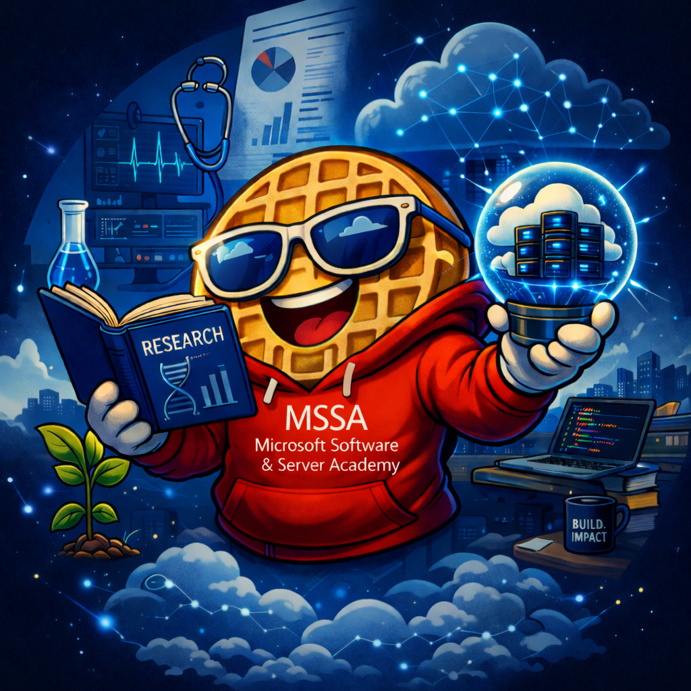

# Hi, I’m Sam 👋
😄 Pronouns: She/Her
### Research → Tech | Cloud & Systems | Human-Centered Technology

I’m a former healthcare research professional transitioning into cloud and systems administration through the Microsoft Software & Systems Academy (MSSA).

I’m passionate about using technology to improve access, equity, and real-world outcomes.

## 👤 About Me

- 🎓 MSSA Server & Cloud Administration (In Progress)
- 🏥 Background in clinical research, compliance, and data systems
- 🌍 Passionate about equitable and human-centered technology
- 🔍 Strong in problem-solving, process improvement, and systems thinking

- ## 🛠️ Technical Skills

- ☁️ Cloud: Azure (in progress)
- 🖥️ Systems: Windows Server, Active Directory
- ⚙️ Tools: PowerShell (learning), Git, GitHub
- 📊 Data: REDCap, data validation, workflow systems

- ## 🌍 What I Care About

I’m especially interested in roles where I can:

- Improve access to technology for underserved communities
- Support ethical and secure systems
- Build solutions that have real human impact

<!--
**GaLeggoMyEggo/GaLeggoMyEggo** is a ✨ _special_ ✨ repository because its `README.md` (this file) appears on your GitHub profile.

Here are some ideas to get you started:

- 🔭 I’m currently working on ...
- 🌱 I’m currently learning ...
- 👯 I’m looking to collaborate on ...
- 🤔 I’m looking for help with ...
- 💬 Ask me about ...
- 📫 How to reach me: ...
- ⚡ Fun fact: ...
-->
